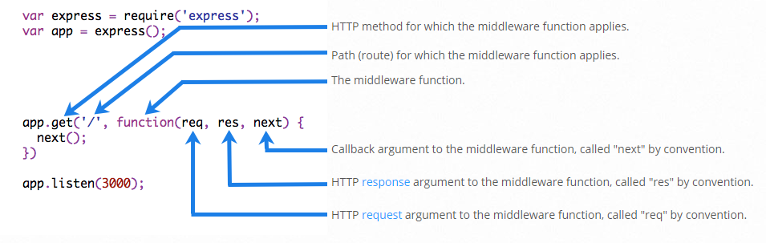

# Express JS Development #

Express JS is NodeJS based Web application framework; also open source. It can serve web pages, static content, run rest API in server side, and also perform a lot stuff that can be done by a Web Server.

Following are the contents of this document:
- [Express JS Development](#express-js-development)
  - [1.Basics](#1basics)
      - [1.1. Installation](#11-installation)
      - [1.2. Hello World sample](#12-hello-world-sample)
      - [1.3. Run the application](#13-run-the-application)
  - [2. Static Contents](#2-static-contents)
      - [2.1 Installation](#21-installation)
      - [2.2 Sample Code](#22-sample-code)
      - [2.3 Alternate option (Recent)](#23-alternate-option-recent)
  - [3. Nodemon](#3-nodemon)
  - [4. Routing](#4-routing)
  - [5. URL Building](#5-url-building)
  - [6. Middleware](#6-middleware)
    - [Structure of a Middleware function](#structure-of-a-middleware-function)
    - [Creating our own middleware](#creating-our-own-middleware)
      - [Basic Middleware](#basic-middleware)
      - [Multiple Middlewares](#multiple-middlewares)
  - [7. Forms](#7-forms)

---

## 1.Basics

#### 1.1. Installation
Simply run the following command in a nodejs application:
```bash
npm install express --save
```
#### 1.2. Hello World sample
A Basic hello world application with express is less than 10 lines. Just create an object for express, assign a get method and start listening in the target port. Example code:
`MyServer.js`
```javascript
// Import the express module
var express = require('express');
// Create an object of express
var app = express();
// HTTP GET handler for root url (/) will return "Hello world!" message
app.get('/', function(req, res){
    res.send("Hello world!");
});
// Listen in the target port
app.listen(8080);
```

#### 1.3. Run the application
Run the application like any nodejs app:
```bash
node MyServer.js
```

---

## 2. Static Contents

We can serve static contents in an express application using 'serve-static' module. This is a middleware in express, which is also available with simple http server. (refer: https://www.npmjs.com/package/serve-static)

#### 2.1 Installation
Install the package using following command:

```bash
npm install serve-static --save
```

#### 2.2 Sample Code
Add the following code to express app to include static contents:
```javascript
// Create an object of express
var app = express();

// Import serve-static module to serve static contents
var serveStatic = require('serve-static');
var path = require('path');
// Get the path of the folder with static contents
var staticRoot = path.join(path.dirname(__dirname), 'webstatic');
// Link this path to the /web relative url
app.use('/web', serveStatic(staticRoot));

app.listen(8080);
```

Now if user tries to open the url `http://localhost:8080/web/index.html` in the browser, the index.html file in the local folder 'webstatic' will be displayed.
*Note: The urls `http://localhost:8080/web` and `http://localhost:8080/web/index.html` both display same content in browser*

#### 2.3 Alternate option (Recent)
Newer versions of express contain static as part of express (4.16 onwards). So we can simply use express.static() method to create a static route.
Example:
```javascript
// Create an object of express
var app = express();

var staticRoot = path.join(path.dirname(__dirname), 'webstatic');
// Link this path to the /web relative url
app.use('/web', express.static(staticRoot));

app.listen(8080);
```


---

## 3. Nodemon

We can use `nodemon` to automatically recompile and restart the application whenever some source code is edited. The `nodemon` library can be installed globally and useful for not only express, but also running other nodejs applications.

Install with following command:
```bash
npm install -g nodemon
```

Run the express application like this:
```bash
nodemon MyServer.js
```

Now whenever the file `MyServer.js` is modified (and saved), then nodemon will automatically restart the application with latest code so this is immensly helpful with development.

---

## 4. Routing

We can add multiple routes to an express application. Each route can do a specific function. For example we can add one route per REST API which is implemented in the express application. The routing is done using the router object created using funciton call `express.Router()`. This object can be assigned GET, POST, PUT, DELETE, etc handlers and then used in the express application.
Example code:
```javascript
var app = express();

// Add a route
var api_about = express.Router();
// Add a get handler which returns some string
api_about.get('/', function(req, res) {
    res.send('<h1>Basic express application</h1>');
});
// Add the router for relative url /api/about
app.use('/api/about', api_about);


app.listen(8080);
```
Here the url `http://localhost:8080/api/about` will return the about information above. The first paramter for **app.use** method is the relative url, the second parameter can be the router or a route based middleware like `serve-static` which can serve static content. In the above example, we have used a router.

---

## 5. URL Building
We can also provide dynamic routes where part of the route (url) can change every request. This kind of url building will help pass parameters to REST API as part of url path itself. Example scenarios: Creating an entry, Deleting an entry, Searching for some product inside category, etc.

The dynamic part of the url will be of the form `:my_identifier(reg-ex)`. We can refer to the actual string by using `req.params.my_identifier` and also we can add validation of parameter by regular expression. 

```javascript
// -------- Dynamic Urls ---------------------
var api_user = express.Router();
api_user.get('/:userid', function(req, res){
    res.send(`<h1>User requested is : ${req.params.userid}</h1>`);
});
app.use('/api/user', api_user);
// Example: http://localhost:8080/api/user/tester
```

---

## 6. Middleware

Middleware functions are functions that have access to the request object (req), the response object (res), and the next middleware function in the application’s request-response cycle. The next middleware function is commonly denoted by a variable named next.

More details in links: 
- https://expressjs.com/en/guide/using-middleware.html
- https://expressjs.com/en/guide/writing-middleware.html

### Structure of a Middleware function



### Creating our own middleware
#### Basic Middleware
A middle is a function that accepts 3 arguments (request, response, next).
- The **request** is request object, **resposne** is the response object, **next** is a function which is actually the next middleware in the chain.
- The implementation function of middleware must call the 'next' function at the end of execution.
- The middleware  must be passed as second argument to the **app.use** method.
```javascript
// Single Middleware function to log request protocol
app.use('/things', function (req, res, next) {
    console.log("A request for things received at " + Date.now());
    next();
});
```

#### Multiple Middlewares

The second, third, etc parameters of the **app.use** method are all middlewares. We can pass any number of middlewares as arguments to the **app.use** method.
```javascript
// Assign multiple middlewares to the whole application
app.use('/user/:id', function (req, res, next) {
    // Inside First Middleware: Print request URL
    console.log('Request URL:', req.originalUrl);
    next();
}, function (req, res, next) {
    // Inside Second Middleware: Print request type
    console.log('Request Type:', req.method);
    next();
});
```

---

## 7. Forms

Form handling in express is much simpler once we use the body-parser middleware.  This middleware takes care of decoding the data posted by the client (in this case form in the browser). This middleware can also parse the posted data as form data, or as json (in REST calls) depending on the way we use it.

A simple HTTP POST handler for the URL is sufficient to handle the posted form.

Installation:
```bash
npm install body-parser --save
```

Form handling example:
```javascript
// Form handling
var bodyParser = require('body-parser');
// Add body parser middleware to parse application/xwww-urlencoded post
app.use(bodyParser.urlencoded({ extended: false }));
// Receive the posted form data
app.post('/web/userInfo', function(req, res){
    console.log(req.body);
    var receivedData = {
        name: req.body.name,
        age: req.body.age
    };
    res.send(`Posted data: ${JSON.stringify(receivedData, space=' ')}`);
 });

```


---

